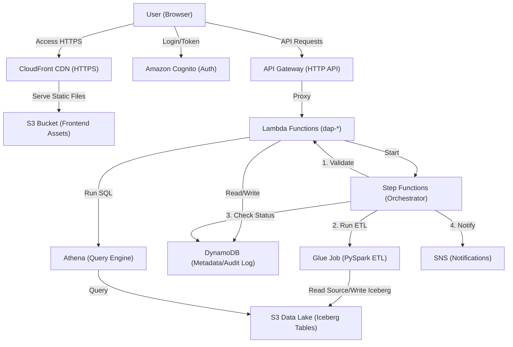

# Mainframe Legacy Archiver & Visualization Platform

A modern, cloud-native solution for migrating, archiving, and analyzing historical mainframe data. This platform provides a secure, scalable, and user-friendly interface to move legacy CSV/Excel/Parquet data into a queryable Data Lake on AWS.

## 📖 How It Works

Imagine you have a dusty library full of old filing cabinets (your mainframe data). You want to move all those files into a modern, searchable digital cloud storage, but you need to make sure nothing gets lost or corrupted along the way.

Here is what this platform does:

1.  **The Reception Desk (Frontend UI)**: You log in to a secure website. You drag and drop your old files (spreadsheets, CSVs) just like uploading photos to social media.
2.  **The Guard (Validation)**: Before accepting the file, the system checks:
    *   "Is this file empty?"
    *   "Does it have the right columns?"
    *   "Are there exactly 10,000 rows like you said?"
    If anything is wrong, it rejects the file and tells you why.
3.  **The Mover (Upload & Orchestration)**: Once accepted, the file is securely shipped to the cloud (AWS S3). A manager (Step Functions) watches over the process to ensure every step happens in order.
4.  **The Librarian (Glue ETL)**: An automated worker reads your file, organizes it, cleans it up (e.g., standardizing dates/names), and places it on the digital shelf (Iceberg Table).
5.  **The Catalog (Glue Data Catalog)**: The system updates its index card so you can search for this data later.
6.  **The Search Engine (Athena)**: You can now type questions like "Show me all sales from 1990" in the Dashboard, and get answers in seconds.

---

## 🏗️ Technical Architecture

The architecture follows a serverless, event-driven pattern on AWS.



### Key Components

| Component | Role | Technology |
|-----------|------|------------|
| **Frontend** | User Interface | React 18, TypeScript, Vite, Recharts, Tailwind |
| **Hosting** | Static Hosting | AWS S3 + CloudFront (CDN) |
| **Auth** | Identity Mgmt | Amazon Cognito (User Pool + Client) |
| **API** | Backend API | Amazon API Gateway (HTTP) + AWS Lambda (Python) |
| **Orchestrator** | Workflow Mgmt | AWS Step Functions |
| **ETL** | Data Processing | AWS Glue (PySpark, Iceberg) |
| **Storage** | Data Lake | AWS S3 (Raw + Curated Zones) |
| **Query** | Ad-hoc SQL | Amazon Athena |
| **Metadata** | Job Tracking | Amazon DynamoDB |
| **Notifications** | Alerts | Amazon SNS |

---

## 🚀 Deployment Guide

### Prerequisites
- **AWS CLI** configured (`aws configure`)
- **Terraform** (v1.0+)
- **Node.js** (v18+) & **npm**
- **Docker** (Optional, for local testing)

### Quick Start

1.  **Clone the Repository**
    ```bash
    git clone https://github.com/your-username/mainframe-legacy-archiver.git
    cd mainframe-legacy-archiver
    ```

2.  **Deploy Infrastructure**
    This script provisions all AWS resources, builds the frontend, and deploys it.
    ```bash
    ./deploy.sh --email your-email@example.com
    ```
    *Wait ~15-20 minutes for CloudFront distribution.*

3.  **Access the Platform**
    The deployment script will output the **Frontend URL**. Click it to open the dashboard.

4.  **Local Development (Optional)**
    Run the frontend locally with hot-reloading:
    ```bash
    ./run.sh
    ```

### Clean Up (Destroy)
To remove all resources and avoid costs:
```bash
./deploy.sh --destroy --auto-approve
```

---

## ✅ Features

- **Drag-and-Drop Upload**: Supports CSV, Excel, Parquet.
- **Smart Validation**: Checks schema, row counts, and checksums before ingestion.
- **Real-Time Tracking**: Watch migration jobs progress step-by-step.
- **Serverless SQL**: Query archived data immediately using Athena integration.
- **Secure Access**: Enterprise-grade authentication via Cognito.
- **Audit Logging**: Every action is recorded in DynamoDB.

---
**Maintained by:** Data Engineering Team
**License:** MIT
